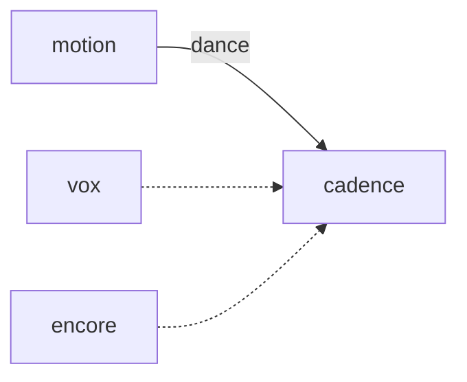

# Cadence

**Pet Rhythm Beat** — Rhythm game where pets dance on synchronized beats using Motion clips.

Part of [ComputerPets](https://github.com/RicheyWorks/computerpets). Map: [computerpets-ecosystem](https://github.com/RicheyWorks/computerpets-ecosystem).

| | |
| --- | --- |
| Status | Design scaffold — loop and engine frozen |
| License | MIT |
| Tokens | Minigames never mint or burn. Tired overlay, not a dead lineage. |
| First pet | [Meet Rui first](https://github.com/RicheyWorks/computerpets/blob/main/docs/START-HERE.md). This game is optional. |

## The loop

Motion already bakes walk cycles. Cadence bakes dance: hit windows keyed to species size (frog vs panda). Misses drop mood slightly, never HP.

## Who plays

Players with a speaker. Motion supplies dance.

## What it is not

HP combat. Misses drop mood slightly.

## Genre and engine

- Genre: **Rhythm minigame**
- Engine: **Godot**
- Stack: Godot 4 · AnimatedSprite · Motion dance clips · Web Audio-equivalent in Godot
- Default surface: `Godot editor`

## Architecture



## How you play

1. Pick a track + pet.
2. Notes from official chart pack (SDK can add).
3. Full combo = treat. Fail = embarrassed emote.
4. Twitch can send emoji notes later.

## First slice

Build this and stop.

**One official chart, Rui dance clip, full combo = treat.**

You know it works when: Audio drift recalibrates. Custom track without a chart refuses.

## Environment

Godot 4

## Failure doctrine

Audio drift → recalibrate, do not punish. No GPU → lower FPS, same windows. Custom track without chart → refuse.

Canon rules that never yield:

- 210 living kinds. No illegal hybrids.
- Overlay pets can get tired, sick, or hide. Tokens are not burned by a minigame.
- Desktop walk stays the main quest. Closing Cadence must leave Rui walking.

## Neighbors

- computerpets-motion
- computerpets-vox
- computerpets-encore
- computerpets-quests

## Layout

```
computerpets-cadence/
  README.md
  LICENSE
  docs/DESIGN.md
  src/                implementation lands here
```

## Run (Windows)

```powershell
godot --path . ; F5
```

Meet Rui first via the [flagship start-here](https://github.com/RicheyWorks/computerpets/blob/main/docs/START-HERE.md). This game is optional.

## Links

- Flagship: [RicheyWorks/computerpets](https://github.com/RicheyWorks/computerpets)
- This repo: [RicheyWorks/computerpets-cadence](https://github.com/RicheyWorks/computerpets-cadence)
- Map: [RicheyWorks/computerpets-ecosystem](https://github.com/RicheyWorks/computerpets-ecosystem)
- Design file: [docs/DESIGN.md](docs/DESIGN.md)

## License

MIT. See [LICENSE](LICENSE).

---

*Two hundred ten living kinds. Keep them so a line does not go quiet.*
