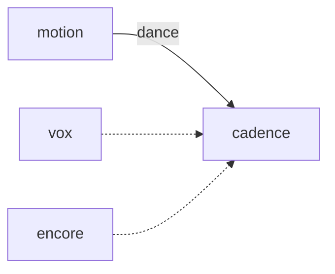

# Cadence

**Let your pet dance to the beat.**

A planned rhythm minigame pairing charted tracks with species-specific dance clips and forgiving failure feedback.

**Stage: design scaffold.** This checkout contains a design document and a source placeholder. The experience below is planned; there is no runnable app or integrated service yet.

[Status](#status) · [Planned experience](#planned-experience) · [Contributor quickstart](#contributor-quickstart) · [Game design](docs/DESIGN.md) · [Ecosystem map](https://github.com/RicheyWorks/computerpets-ecosystem)

## Status

| Available today | What you can inspect |
| --- | --- |
| [Game design](docs/DESIGN.md) | Intended behavior, boundaries, and planned dependencies. |
| [Source placeholder](src/game.gd) | Godot Node stub; no project.godot or playable scene is checked in. |
| [MIT license](LICENSE) | Licensing terms for the repository. |

Gameplay, endpoints, integration arrows, and failure handling on this page describe implementation targets. No build/test harness, CI workflow, or product screenshots are included in this scaffold.

## Planned experience

- Pick a track + pet.
- Notes from official chart pack (SDK can add).
- Full combo = treat. Fail = embarrassed emote.
- Twitch can send emoji notes later.

### Planned technology

- Genre: **Rhythm minigame**
- Engine: **Godot**
- Stack: Godot 4 · AnimatedSprite · Motion dance clips · Web Audio-equivalent in Godot
- Default surface: `Godot editor`

### Planned connections

These arrows show intended dependencies, rather than working integrations.



## Contributor quickstart

With access to this private repository, Git and PowerShell are enough to review the scaffold:

```powershell
git clone https://github.com/RicheyWorks/computerpets-cadence.git
Set-Location computerpets-cadence
Get-Content docs/DESIGN.md
Get-Content src/game.gd
```

Read [Game design](docs/DESIGN.md) before choosing implementation details. The commands above inspect the checked-in files; app installation, editor launch, and server startup become possible after a buildable project and entry point are added.

### First implementation target

**One official chart, Rui dance clip, full combo = treat.**

You know it works when: Audio drift recalibrates. Custom track without a chart refuses.

Treat this as an acceptance target for a future implementation. Start with the documented slice, add the required project setup and focused tests, and update these instructions with commands that work from a fresh clone.

## Design boundaries

1. Minigames cannot mint or burn NFTs by themselves (Minter is the write path).
2. Stats come from lived overlay care + Dojo caps, not cash shop.
3. Species kits stay inside Lore. Illegal hybrids never spawn.
4. Fail soft: the desktop overlay process is not this process.

**Required failure behavior:**

Audio drift → recalibrate, do not punish. No GPU → lower FPS, same windows. Custom track without chart → refuse.

## Ecosystem

- [computerpets-motion](https://github.com/RicheyWorks/computerpets-motion)
- [computerpets-vox](https://github.com/RicheyWorks/computerpets-vox)
- [computerpets-encore](https://github.com/RicheyWorks/computerpets-encore)
- [computerpets-quests](https://github.com/RicheyWorks/computerpets-quests)

Start with the [ComputerPets flagship](https://github.com/RicheyWorks/computerpets) for the desktop pet. This repository describes an optional extension; the [ecosystem map](https://github.com/RicheyWorks/computerpets-ecosystem) explains the broader plan.

## License

MIT. See [LICENSE](LICENSE).
